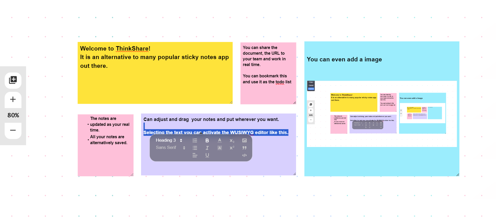

# ThinkShare - Saas Project 

visit here - https://thinkshare.azurewebsites.net/
 
https://github.com/user-attachments/assets/6c32e84a-7f7b-43be-b6c1-41b7b0255c2f

# Architecture




- [ThinkShare - Saas Project](#thinkshare---saas-project)
  - [📃Description](#description)
  - [🚀Features](#features)
  - [📦 Getting Started](#-getting-started)
  - [⚡Technologies Used](#technologies-used)
  - [⚙️ Contributing](#️-contributing)
  - [🧪Testing](#testing)
  - [🔨 Pushing your code](#-pushing-your-code)
  - [📁Folder Structure](#folder-structure)
  - [🐛 Bug Reporting](#-bug-reporting)
  - [⭐ Feature Request](#-feature-request)
  - [📋 Release Notes](#-release-notes)
  - [❤️Acknowledgments](#️acknowledgments)

<a id="description"></a>

## 📃Description 

ThinkShare is a Open Source alternative to many collabroative sticky notes productivity tools out there. ThinkShare allows multiple users to create, edit, and share notes in real-time. The app is built using the MERN stack (MongoDB, Express.js, React, Node.js) and utilizes WebSockets for real-time communication. Users can generate draggable notes, edit their contents, and collaborate with others on the same note simultaneously. The app also includes features like note organization, tagging, text formatting, and media embedding.


<a id="features"></a>

## 🚀Features  

- Real Time for all users
- Multiple users collaboration
- Genertion of new notes
- Draggable notes
- Fully customizable notes with WUSIWUG editor
- Auto save notes for sharing later
- [Request more features](#feature-request)...


<a id="-getting-started"></a>

## 📦 Getting Started

- Visit https://thinkshare.vercel.app/  (the site may take some time for the first time since the hosting tier is the free one an the server might start when you visit the first time taking time between 2-5 minutes)
- Wait for your first sticky note to be generated.
- When you see your first note you are ready to go.
- Share the page url which would have a unique id after 'document/pageId' with your team which would help you to collaborate, you can share the entire url containing the unique Id.
- The sticky notes will be updated in real time for all team members.
- When you select the text there will be a tool tip giving you options to format your note.
- You can even add images through the tool tip.
- You can generate and drag the notes according to your needs.
- You can bookmark the tab so that you can use it in future or as a todo list and manage your tasks.


<a id="technologies-used"></a>

## ⚡Technologies Used

This project uses the following technologies:

* ReactJS: a JavaScript library used to build the frontend user interface
* Material UI: a React component library used to style the frontend user interface
* SocketIO: a Node.js websocket application framework used to build the socket
* MongoDB: a NoSQL database used to store data for the web application
* Mongoose: an object data modeling (ODM) library for MongoDB used to interact with the database


<a id="️-contributing"></a>

## ⚙️ Contributing

To get started with this project, you'll need to have the following installed:

* Node.js (v12 or higher)
* MongoDB
Once you have these dependencies installed, follow these steps to set up the project:

0. Fork this repository: https://github.com/iqbalcodes6602/thinkshare.git
1. Clone your fork: 
  ```bash
  git clone https://github.com/<your github username>/thinkshare.git
  ```
1. Install backend dependencies: 
```bash
cd server
```
``` bash
 npm install
```
1. Install frontend dependencies: 
``` bash
cd client
``` 
``` bash
npm install
```
<div style="border: 2px solid #ccc; padding: 10px;">

**❗ Important Note**

Before starting the backend server, you need to set up environment variables.
* Environment Variables for frontend
   1. Create a `.env` file in the `client` directory.
   2. Populate the `.env` file with backend URL:

      ```plaintext
      REACT_APP_BACKEND_URL=http://localhost:3001
* Environment Variables for backend
   1. Create a `.env` file in the `server` directory.
   2. Populate the `.env` file with your MongoDB connection URL:

      ```plaintext
      MONGO_URL=mongodb://your-mongodb-url
</div>

4. Start the backend server: 
``` bash
cd server 
```
``` bash
nodemon server.js
```
5. Start the frontend client:
``` bash
cd client 
```
``` bash
npm start
```
  
  * The backend server with the socketio will start running on http://localhost:3001
  
  * You can access the web application by visiting http://localhost:3000


<a id="testing"></a>

## 🧪Testing 
Before pushing the code to the repository, make sure to run the tests. To run the tests, follow these steps:
IN ROOT DIRECTORY
1. Install dependencies for testing: 
```bash
npm i 
```
2. Run the tests: 
```bash
npm test
```


<a id="-pushing-your-code"></a>

## 🔨 Pushing your code 
If you would like to contribute to this project, please follow these steps:

  &nbsp;&nbsp;&nbsp;&nbsp;1. Fork this repository.
  
  &nbsp;&nbsp;&nbsp;&nbsp;2. Create a new branch for your changes: git checkout -b your-branch-name
  
  &nbsp;&nbsp;&nbsp;&nbsp;3. Make your changes and commit them: git commit -am "Add your commit message here"
  
  &nbsp;&nbsp;&nbsp;&nbsp;4. Push your changes to your forked repository: git push origin your-branch-name
  
  &nbsp;&nbsp;&nbsp;&nbsp;5. Open a pull request on this repository.

<a id="folder-structure"></a>

## 📁Folder Structure 
The project's folder structure is as follows:

* server: contains the backend code written in Express and Mongoose
    * models: contains Mongoose models for the database
    * package.json: contains dependencies and scripts for the backend
    * package-lock.json: contains dependencies and scripts with version for the backend
* client: contains the frontend code written in React and Material UI
    * public: contains static files used by the frontend
    * src: contains the source code for the frontend
    * src/components: contains reusable React components
    * src/styles: contains styling for components
    * package.json: contains dependencies and scripts for the frontend
    * package-lock.json: contains dependencies and scripts with version for the frontend
* design: contains some images used in the README.md file and some image files used for UI design
* tests: contains some test files for the backend and frontend yet to be updated
* README.md: contains information about the project
* .gitignore: contains files and folders to be ignored by git
* package.json: contains dependencies and scripts for the JEST testing in root
* package-lock.json: contains dependencies and scripts with version for the JEST testing in root


<a id="-bug-reporting"></a>

## 🐛 Bug Reporting

Feel free to [open an issue](https://github.com/iqbalcodes6602/thinkshare/issues) on GitHub if you find any bug.

<a id="-feature-request"></a>

## ⭐ Feature Request

- Feel free to [Open an issue](https://github.com/iqbalcodes6602/thinkshare/issues) on GitHub to request any additional features you might need for your use case.
- Connect with me on [LinkedIn](https://www.linkedin.com/in/anas-iqbal-07053b261/). I'd love ❤️️ to hear where you are using this library.


<a id="-release-notes"></a>

## 📋 Release Notes

Check [here](https://github.com/iqbalcodes6602/thinkshare/issues) for release notes.


<a id="️acknowledgments"></a>

## ❤️Acknowledgments

- Thanks to [Anas Iqbal](https://github.com/iqbalcodes6602) for inspiration and support during the development of this app.
